# Architecture Report

**agent-coordinator** — Multi-agent coordination MCP server

Generated: 2026-04-03T14:10:34.519183+00:00  
Git SHA: `1c557e31bcc46be4af9aae9bf717bb4b1a9a5804`

## System Overview

*Data sources: [architecture.graph.json](architecture.graph.json), [architecture.summary.json](architecture.summary.json), [python_analysis.json](python_analysis.json)*

This is a **Python MCP server** with 43 modules exposing **90 MCP endpoints** (79 tools, 9 resources, 2 prompts), backed by **24 Postgres tables**. The codebase contains 562 functions (237 async) and 126 classes.

| Metric | Count |
|--------|-------|
| Total nodes | 1085 |
| Total edges | 569 |
| Python modules | 43 |
| Functions | 562 (237 async) |
| Classes | 126 |
| Mcp Endpoints | 90 |
| DB tables | 24 |
| Python nodes | 731 |
| Sql nodes | 354 |

## Module Responsibility Map

*Data sources: [python_analysis.json](python_analysis.json), [architecture.graph.json](architecture.graph.json)*

| Module | Layer | Role | In / Out |
|--------|-------|------|----------|
| `agents_config` | Service | Load and validate ``agents.yaml``. | 6 / 3 |
| `approval` | Service | Parse a datetime value from various formats. | 10 / 2 |
| `assurance` | Service | — | 0 / 0 |
| `audit` | Foundation | Get the global audit service instance. | 37 / 4 |
| `config` | Foundation | Get the global configuration instance. | 57 / 2 |
| `coordination_api` | Entry | Verify the API key for write operations. | 0 / 93 |
| `coordination_cli` | Service | Bridge async service calls to synchronous CLI. | 0 / 36 |
| `coordination_mcp` | Entry | Get the current agent ID from config. | 0 / 78 |
| `db` | Foundation | Factory: returns the appropriate DatabaseClient based on config. | 39 / 4 |
| `db_postgres` | Service | Coerce a PostgREST filter string value to the appropriate Python type. | 1 / 1 |
| `discovery` | Service | Get the global discovery service instance. | 11 / 8 |
| `docker_manager` | Service | Return ``True`` if the ``colima`` binary is on PATH. | 0 / 0 |
| `event_bus` | Foundation | Classify event urgency based on type. | 13 / 0 |
| `feature_registry` | Foundation | Get the global feature registry service instance. | 22 / 8 |
| `github_coordination` | Service | Get the global GitHub coordination service instance. | 0 / 4 |
| `guardrails` | Foundation | Reset cached metric instruments (for testing). | 12 / 10 |
| `handoffs` | Foundation | Get the global handoff service instance. | 11 / 9 |
| `locks` | Foundation | Lazy-init metric instruments. Returns None tuple when disabled. | 17 / 16 |
| `memory` | Foundation | Get the global memory service instance. | 11 / 8 |
| `merge_queue` | Foundation | Parse an ISO datetime string, returning None for empty/None. | 23 / 9 |
| `migrations` | Service | Return sorted list of (sequence_number, filename, path) for all migration files. | 5 / 2 |
| `network_policies` | Service | Get the global network policy service instance. | 2 / 4 |
| `notifications` | Service | Send an event notification. Returns True on success. | 3 / 6 |
| `notifications.base` | Service | Send an event notification. Returns True on success. | 0 / 0 |
| `notifications.gmail` | Service | Send an HTML email notification for the event. | 0 / 0 |
| `notifications.notifier` | Service | Register a notification channel. | 0 / 0 |
| `notifications.relay` | Service | Extract a notification token from an email subject line. | 0 / 0 |
| `notifications.telegram` | Service | Send an event notification as a Telegram message with Markdown formatting. | 0 / 0 |
| `notifications.templates` | Service | Escape a value for safe HTML embedding. | 0 / 0 |
| `notifications.webhook` | Service | POST JSON payload with event data to the webhook URL. | 0 / 0 |
| `policy_engine` | Foundation | Get the global policy engine based on configuration. | 23 / 19 |
| `policy_sync` | Service | Return the singleton PolicySyncService instance. | 0 / 0 |
| `port_allocator` | Service | Return the global ``PortAllocatorService`` singleton. | 9 / 1 |
| `profile_loader` | Service | Recursively merge *override* into a copy of *base*. | 3 / 0 |
| `profiles` | Foundation | Get the global profiles service instance. | 11 / 7 |
| `risk_scorer` | Service | Get the global risk scorer instance. | 0 / 2 |
| `session_grants` | Service | Parse a datetime value from various formats. | 2 / 3 |
| `status` | Service | Generate an 8-character URL-safe token. | 4 / 0 |
| `teams` | Service | Get the global teams configuration. | 1 / 0 |
| `telemetry` | Foundation | Initialize OpenTelemetry providers based on environment configuration. | 21 / 0 |
| `watchdog` | Service | Return the singleton WatchdogService. | 3 / 4 |
| `work_queue` | Foundation | Get the global work queue service instance. | 17 / 31 |

**Layers**: Entry = exposes MCP endpoints; Service = domain logic; Foundation = imported by 3+ modules (config, db, audit).

## Dependency Layers

*Data source: [python_analysis.json](python_analysis.json)*

```
┌─────────────────────────────────────────────────┐
│  ENTRY       coordination_api, coordination_mcp  │
│             ↓ imports ↓                          │
│  SERVICE     agents_config, approval, assurance, coordination_cli│
│              db_postgres, discovery, docker_manager, github_coordination│
│              migrations, network_policies, notifications, notifications.base│
│              notifications.gmail, notifications.notifier, notifications.relay, notifications.telegram│
│              notifications.templates, notifications.webhook, policy_sync, port_allocator│
│              profile_loader, risk_scorer, session_grants, status│
│              teams, watchdog                     │
│             ↓ imports ↓                          │
│  FOUNDATION  audit, config, db, event_bus, feature_registry, guardrails, handoffs, locks, memory, merge_queue, policy_engine, profiles, telemetry, work_queue│
└─────────────────────────────────────────────────┘
```

**Single points of failure** — changes to these modules ripple widely:

- `config` — imported by 19 modules
- `db` — imported by 18 modules
- `audit` — imported by 13 modules
- `telemetry` — imported by 6 modules
- `policy_engine` — imported by 6 modules
- `guardrails` — imported by 4 modules
- `feature_registry` — imported by 4 modules
- `profiles` — imported by 4 modules
- `event_bus` — imported by 3 modules
- `handoffs` — imported by 3 modules
- `locks` — imported by 3 modules
- `memory` — imported by 3 modules
- `work_queue` — imported by 3 modules
- `merge_queue` — imported by 3 modules

## Entry Points

*Data sources: [architecture.graph.json](architecture.graph.json), [python_analysis.json](python_analysis.json)*

### Tools (40)

| Endpoint | Description |
|----------|-------------|
| `acquire_lock` | Acquire an exclusive lock on a file before modifying it. |
| `allocate_ports` | Allocate a conflict-free port block for a parallel docker-compose stack. |
| `analyze_feature_conflicts` | Analyze resource conflicts between a candidate and active features. |
| `check_approval` | Check the status of an approval request. |
| `check_guardrails` | Check an operation for destructive patterns. |
| `check_locks` | Check which files are currently locked. |
| `check_policy` | Check if an operation is authorized by the policy engine. |
| `cleanup_dead_agents` | Clean up agents that have stopped responding. |
| `complete_work` | Mark a claimed task as completed. |
| `deregister_feature` | Deregister a feature (mark as completed or cancelled). |
| `discover_agents` | Discover other agents working in this coordination system. |
| `enqueue_merge` | Add a feature to the merge queue for ordered merging. |
| `get_agent_dispatch_configs` | Get CLI dispatch configurations for all agents with a `cli` section. |
| `get_feature` | Get details of a specific registered feature. |
| `get_merge_queue` | Get all features in the merge queue, ordered by priority. |
| `get_my_profile` | Get the current agent's profile including trust level and permissions. |
| `get_next_merge` | Get the highest-priority feature ready to merge. |
| `get_task` | Retrieve a specific task by ID. |
| `get_work` | Claim a task from the work queue. |
| `heartbeat` | Send a heartbeat to indicate this agent is still alive. |
| `list_active_features` | List all active features ordered by merge priority. |
| `list_policy_versions` | List version history for a Cedar policy. |
| `mark_merged` | Mark a feature as merged and deregister it from the registry. |
| `ports_status` | List all active port allocations. |
| `query_audit` | Query the audit trail for recent operations. |
| `read_handoff` | Read previous handoff documents for session continuity. |
| `recall` | Recall relevant memories from past sessions. |
| `register_feature` | Register a feature with its resource claims for cross-feature coordination. |
| `register_session` | Register this agent session for discovery by other agents. |
| `release_lock` | Release a lock you previously acquired. |
| `release_ports` | Release a previously allocated port block. |
| `remember` | Store an episodic memory for cross-session learning. |
| `remove_from_merge_queue` | Remove a feature from the merge queue without merging. |
| `report_status` | Report agent status (phase transitions, escalations) to the coordinator. |
| `request_approval` | Request human approval for a high-risk operation. |
| `request_permission` | Request a session-scoped permission grant. |
| `run_pre_merge_checks` | Run pre-merge validation checks on a feature. |
| `submit_work` | Submit a new task to the work queue. |
| `validate_cedar_policy` | Validate Cedar policy text against the schema. |
| `write_handoff` | Write a handoff document to preserve session context. |

### Resources (9)

| Endpoint | Description |
|----------|-------------|
| `audit://recent` | Recent audit log entries. |
| `features://active` | Active features in the registry with their resource claims and priorities. |
| `guardrails://patterns` | Active guardrail patterns for destructive operation detection. |
| `handoffs://recent` | Recent handoff documents from agent sessions. |
| `locks://current` | All currently active file locks. |
| `memories://recent` | Recent episodic memories across all agents. |
| `merge-queue://pending` | Features queued for merge with their status and priority. |
| `profiles://current` | Current agent's profile and permissions. |
| `work://pending` | Tasks waiting to be claimed from the work queue. |

### Prompts (2)

| Endpoint | Description |
|----------|-------------|
| `coordinate_file_edit` | Template for safely editing a file with coordination. |
| `start_work_session` | Template for starting a coordinated work session. |

### Other (39)

| Endpoint | Description |
|----------|-------------|
| `/agents/dispatch-configs` | Get CLI dispatch configs for agents with cli sections. |
| `/approvals/pending` | List pending approval requests. |
| `/approvals/{request_id}/decide` | Approve or deny an approval request. |
| `/audit` | Query audit trail entries. |
| `/features/active` | List all active features ordered by merge priority. |
| `/features/conflicts` | Analyze resource conflicts between a candidate and active features. |
| `/features/deregister` | Deregister a feature (mark completed/cancelled). |
| `/features/register` | Register a feature with resource claims. |
| `/features/{feature_id}` | Get details of a specific feature. |
| `/guardrails/check` | Check an operation for destructive patterns. |
| `/handoffs/read` | Read previous handoff documents for session continuity. |
| `/handoffs/write` | Write a handoff document for session continuity. |
| `/health` | Health check endpoint with database connectivity check. |
| `/locks/acquire` | Acquire a file lock. Cloud agents call this before modifying files. |
| `/locks/release` | Release a file lock. |
| `/locks/status/{file_path:path}` | Check lock status for a file. Read-only, no API key required. |
| `/memory/query` | Query relevant memories for a task. |
| `/memory/store` | Store an episodic memory. |
| `/merge-queue` | Get all features in the merge queue. |
| `/merge-queue/check/{feature_id}` | Run pre-merge validation checks on a feature. |
| `/merge-queue/enqueue` | Add a feature to the merge queue. |
| `/merge-queue/merged/{feature_id}` | Mark a feature as merged and deregister it. |
| `/merge-queue/next` | Get the highest-priority feature ready to merge. |
| `/merge-queue/{feature_id}` | Remove a feature from the merge queue without merging. |
| `/notifications/status` | Get event bus and notification system status. |
| `/notifications/test` | Send a test notification through the event bus. |
| `/policies/{policy_name}/rollback` | Rollback a Cedar policy to a previous version. |
| `/policies/{policy_name}/versions` | List version history for a Cedar policy. |
| `/policy/check` | Check if an operation is authorized by the policy engine. |
| `/policy/validate` | Validate Cedar policy text against the schema. |
| `/ports/allocate` | Allocate a block of ports for a session. |
| `/ports/release` | Release a port allocation for a session. |
| `/ports/status` | List all active port allocations. Read-only, no API key required. |
| `/profiles/me` | Get the calling agent's profile. |
| `/status/report` | Accept status reports from agent hooks (Stop/SubagentStop). |
| `/work/claim` | Claim a task from the work queue. |
| `/work/complete` | Mark a task as completed. |
| `/work/get` | Get a specific task by ID. |
| `/work/submit` | Submit new work to the queue. |

## Architecture Health

*Data source: [architecture.diagnostics.json](architecture.diagnostics.json)*

**813 findings** across 4 categories:

### Orphan — 339

339 symbols are unreachable from any entrypoint — may be dead code or missing wiring.

- '__init__' is unreachable from any entrypoint or test
- 'agents_config' is unreachable from any entrypoint or test
- 'assurance' is unreachable from any entrypoint or test
- 'audit' is unreachable from any entrypoint or test
- 'config' is unreachable from any entrypoint or test
- ... and 334 more

### Reachability — 48

48 entrypoints have downstream dependencies but no DB writes or side effects.

Breakdown: 46 info, 2 warning.

- Entrypoint 'acquire_lock' has downstream dependencies but none touch a DB or produce side effects
- Entrypoint 'release_lock' has downstream dependencies but none touch a DB or produce side effects
- Entrypoint 'check_lock_status' has downstream dependencies but none touch a DB or produce side effects
- Entrypoint 'store_memory' has downstream dependencies but none touch a DB or produce side effects
- Entrypoint 'query_memories' has downstream dependencies but none touch a DB or produce side effects
- ... and 43 more

### Test Coverage — 378

378 functions lack test references — consider adding tests for critical paths.

- Function 'AgentEntry' has no corresponding test references
- Function 'AuditEntry' has no corresponding test references
- Function 'AuditResult' has no corresponding test references
- Function 'AuditService' has no corresponding test references
- Function 'AuditTimer' has no corresponding test references
- ... and 373 more

### Disconnected Flow (expected) — 48

48 MCP routes have no frontend callers — expected (clients are AI agents).

- Backend route 'get_my_profile' has no frontend callers
- Backend route 'coordinate_file_edit' has no frontend callers
- Backend route 'acquire_lock' has no frontend callers
- Backend route 'health' has no frontend callers
- Backend route 'get_work' has no frontend callers
- ... and 43 more

## High-Impact Nodes

*Data sources: [high_impact_nodes.json](high_impact_nodes.json), [parallel_zones.json](parallel_zones.json)*

52 nodes with >= 5 transitive dependents. Changes to these ripple through the codebase — test thoroughly.

| Node | Dependents | Risk |
|------|------------|------|
| `config.get_config` | 85 | Critical — affects 85 downstream functions (23 modules affected) |
| `policy_engine.get_policy_engine` | 32 | Critical — affects 32 downstream functions (6 modules affected) |
| `coordination_cli._print_dict` | 26 | Critical — affects 26 downstream functions (modules: coordination_cli) |
| `coordination_cli._run` | 25 | Critical — affects 25 downstream functions (modules: coordination_cli) |
| `coordination_cli._output` | 25 | Critical — affects 25 downstream functions (modules: coordination_cli) |
| `config` | 24 | Critical — affects 24 downstream functions (24 modules affected) |
| `audit.get_audit_service` | 24 | Critical — affects 24 downstream functions (13 modules affected) |
| `db.create_db_client` | 22 | Critical — affects 22 downstream functions (20 modules affected) |
| `db_postgres` | 21 | Critical — affects 21 downstream functions (21 modules affected) |
| `db.get_db` | 21 | Critical — affects 21 downstream functions (19 modules affected) |
| `db` | 20 | Critical — affects 20 downstream functions (20 modules affected) |
| `merge_queue.get_merge_queue_service` | 20 | Critical — affects 20 downstream functions (modules: coordination_api, coordination_cli, coordination_mcp) |
| `coordination_api.resolve_identity` | 19 | High — test `coordination_api` changes thoroughly (modules: coordination_api) |
| `feature_registry.get_feature_registry_service` | 18 | High — test `feature_registry` changes thoroughly (modules: coordination_api, coordination_cli, coordination_mcp, merge_queue) |
| `coordination_api.authorize_operation` | 16 | High — test `coordination_api` changes thoroughly (modules: coordination_api) |
| `profile_loader.interpolate` | 16 | High — test `profile_loader` changes thoroughly (5 modules affected) |
| `profile_loader._load_secrets_file` | 15 | High — test `profile_loader` changes thoroughly (5 modules affected) |
| `work_queue.get_work_queue_service` | 14 | High — test `work_queue` changes thoroughly (modules: coordination_api, coordination_cli, coordination_mcp) |
| `audit` | 13 | High — test `audit` changes thoroughly (13 modules affected) |
| `teams.TeamsConfig.validate` | 12 | High — test `teams` changes thoroughly (5 modules affected) |
| `agents_config._default_agents_path` | 11 | High — test `agents_config` changes thoroughly (modules: agents_config, config, coordination_api, coordination_mcp) |
| `agents_config._default_secrets_path` | 11 | High — test `agents_config` changes thoroughly (modules: agents_config, config, coordination_api, coordination_mcp) |
| `agents_config.load_agents_config._parse_mode` | 11 | High — test `agents_config` changes thoroughly (modules: agents_config, config, coordination_api, coordination_mcp) |
| `locks.get_lock_service` | 11 | High — test `locks` changes thoroughly (modules: coordination_api, coordination_cli, coordination_mcp) |
| `agents_config.load_agents_config` | 10 | High — test `agents_config` changes thoroughly |
| `telemetry` | 9 | Moderate |
| `notifications.templates._esc` | 9 | Moderate |
| `telemetry.get_tracer` | 9 | Moderate |
| `network_policies` | 8 | Moderate |
| `profiles` | 8 | Moderate |
| ... | | 22 more |

## Code Health Indicators

*Data source: [python_analysis.json](python_analysis.json)*

### Quick Stats

| Indicator | Value |
|-----------|-------|
| Async ratio | 237/562 (42%) |
| Docstring coverage | 419/562 (75%) |
| Dead code candidates | 281 |

### Hot Functions

Functions called by the most other functions — changes here have wide blast radius:

| Function | Callers |
|----------|---------|
| `config.get_config` | 38 |
| `coordination_cli._run` | 25 |
| `coordination_cli._output` | 25 |
| `audit.get_audit_service` | 24 |
| `db.get_db` | 21 |
| `merge_queue.get_merge_queue_service` | 20 |
| `coordination_api.resolve_identity` | 19 |
| `feature_registry.get_feature_registry_service` | 18 |
| `policy_engine.get_policy_engine` | 17 |
| `coordination_api.authorize_operation` | 16 |

### Dead Code Candidates

281 functions are unreachable from entrypoints via static analysis. Some may be used dynamically (e.g., classmethods, test helpers).

- **agents_config** (4): `get_mcp_env`, `get_agent_config`, `reset_agents_config`, `get_agent_isolation`
- **approval** (8): `db`, `submit_request`, `check_request`, `decide_request`, `expire_stale_requests`, `list_pending`, ... (+2)
- **audit** (6): `from_dict`, `db`, `log_operation`, `_insert_audit_entry`, `query`, `timed`
- **config** (4): `is_enabled`, `create_client`, `from_env`, `reset_config`
- **coordination_api** (4): `verify_api_key`, `create_coordination_api`, `lifespan`, `main`
- **coordination_cli** (26): `cmd_health`, `cmd_feature_register`, `cmd_feature_deregister`, `cmd_feature_show`, `cmd_feature_list`, `cmd_feature_conflicts`, ... (+20)
- **coordination_mcp** (1): `main`
- **db** (17): `rpc`, `query`, `insert`, `update`, `delete`, `close`, ... (+11)
- **db_postgres** (7): `_get_pool`, `rpc`, `query`, `insert`, `update`, `delete`, ... (+1)
- **discovery** (5): `db`, `register`, `discover`, `heartbeat`, `cleanup_dead_agents`
- **docker_manager** (2): `start_container`, `wait_for_healthy`
- **event_bus** (13): `to_json`, `running`, `failed`, `on_event`, `start`, `stop`, ... (+7)
- **feature_registry** (6): `db`, `register`, `deregister`, `get_feature`, `get_active_features`, `analyze_conflicts`
- **github_coordination** (9): `from_dict`, `db`, `parse_lock_labels`, `parse_branch`, `sync_label_locks`, `sync_branch_tracking`, ... (+3)
- **guardrails** (5): `reset_guardrail_instruments`, `from_dict`, `db`, `_load_patterns`, `check_operation`
- **handoffs** (4): `db`, `write`, `read`, `get_recent`
- **locks** (7): `is_valid_lock_key`, `db`, `acquire`, `release`, `check`, `extend`, ... (+1)
- **memory** (3): `db`, `remember`, `recall`
- **merge_queue** (8): `db`, `registry`, `enqueue`, `get_queue`, `get_next_to_merge`, `run_pre_merge_checks`, ... (+2)
- **network_policies** (2): `db`, `check_domain`
- **notifications** (38): `send`, `test`, `supports_reply`, `send`, `test`, `supports_reply`, ... (+32)
- **policy_engine** (25): `db`, `check_operation`, `_do_check_operation`, `check_network_access`, `list_policy_versions`, `rollback_policy`, ... (+19)
- **policy_sync** (13): `start`, `stop`, `on_policy_change`, `running`, `on_policy_change`, `start`, ... (+7)
- **port_allocator** (6): `env_snippet`, `allocate`, `release`, `status`, `_cleanup_expired`, `reset_port_allocator`
- **profile_loader** (2): `resolve_dynamic_dsn`, `_replace`
- **profiles** (5): `from_dict`, `db`, `get_profile`, `check_operation`, `_log_denial`
- **risk_scorer** (10): `db`, `compute_score`, `get_violation_count`, `_trust_factor`, `_operation_factor`, `_resource_factor`, ... (+4)
- **session_grants** (7): `db`, `request_grant`, `get_active_grants`, `has_grant`, `revoke_grants`, `_row_to_grant`, ... (+1)
- **status** (1): `cleanup_expired_tokens`
- **teams** (5): `from_dict`, `get_agent`, `get_agents_with_capability`, `get_teams_config`, `reset_teams_config`
- **telemetry** (4): `set_attribute`, `set_status`, `record_exception`, `reset_telemetry`
- **watchdog** (14): `db`, `running`, `start`, `stop`, `run_once`, `_loop`, ... (+8)
- **work_queue** (10): `db`, `_resolve_trust_level`, `claim`, `complete`, `submit`, `get_pending`, ... (+4)

## Parallel Modification Zones

*Data source: [parallel_zones.json](parallel_zones.json)*

**760 independent groups** identified. The largest interconnected group has 262 modules; 956 modules are leaf nodes (safe to modify in isolation).

**24 high-impact modules** act as coupling points — parallel changes touching these need coordination.

### Interconnected Groups

**Group 0** (262 members spanning 31 modules): `agents_config`, `approval`, `audit`, `config`, `coordination_api`, `coordination_cli`, `coordination_mcp`, `db`
  ... and 23 more modules

**Group 1** (29 members spanning 29 modules): `agents_config`, `approval`, `audit`, `config`, `coordination_api`, `coordination_cli`, `coordination_mcp`, `db`
  ... and 21 more modules

**Group 2** (14 members spanning 1 modules): `notifications`

**Group 3** (9 members spanning 1 modules): `db_postgres`

**Group 4** (6 members spanning 1 modules): `docker_manager`

**Group 5** (5 members spanning 4 modules): `approval`, `locks`, `merge_queue`, `session_grants`

**Group 6** (4 members spanning 3 modules): `discovery`, `feature_registry`, `work_queue`

**Group 7** (2 members spanning 2 modules): `network_policies`, `policy_engine`

**Group 8** (2 members spanning 1 modules): `port_allocator`

**Group 9** (2 members spanning 2 modules): `telemetry`, `work_queue`

### Leaf Modules (956)

956 modules have no dependents — changes are fully isolated. 750 of the 760 groups are singletons.

## Architecture Diagrams

*Data source: [architecture.graph.json](architecture.graph.json)*

### Container View


### Backend Components

```mermaid
flowchart TB
    __init__["__init__ (1 symbols)"]
    agents_config["agents_config (18 symbols)"]
    approval["approval (14 symbols)"]
    assurance["assurance (1 symbols)"]
    audit["audit (17 symbols)"]
    config["config (39 symbols)"]
    coordination_api["coordination_api (71 symbols)"]
    coordination_cli["coordination_cli (32 symbols)"]
    coordination_mcp["coordination_mcp (55 symbols)"]
    db["db (23 symbols)"]
    db_postgres["db_postgres (14 symbols)"]
    discovery["discovery (20 symbols)"]
    docker_manager["docker_manager (8 symbols)"]
    event_bus["event_bus (21 symbols)"]
    feature_registry["feature_registry (19 symbols)"]
    github_coordination["github_coordination (16 symbols)"]
    guardrails["guardrails (15 symbols)"]
    handoffs["handoffs (14 symbols)"]
    locks["locks (18 symbols)"]
    memory["memory (13 symbols)"]
    merge_queue["merge_queue (17 symbols)"]
    migrations["migrations (5 symbols)"]
    network_policies["network_policies (8 symbols)"]
    notifications____init__["notifications.__init__ (1 symbols)"]
    notifications__base["notifications.base (10 symbols)"]
    notifications__gmail["notifications.gmail (13 symbols)"]
    notifications__notifier["notifications.notifier (14 symbols)"]
    notifications__relay["notifications.relay (6 symbols)"]
    notifications__telegram["notifications.telegram (11 symbols)"]
    notifications__templates["notifications.templates (11 symbols)"]
    notifications__webhook["notifications.webhook (8 symbols)"]
    policy_engine["policy_engine (36 symbols)"]
    policy_sync["policy_sync (17 symbols)"]
    port_allocator["port_allocator (12 symbols)"]
    profile_loader["profile_loader (14 symbols)"]
    profiles["profiles (14 symbols)"]
    risk_scorer["risk_scorer (14 symbols)"]
    session_grants["session_grants (13 symbols)"]
    status["status (6 symbols)"]
    teams["teams (10 symbols)"]
    telemetry["telemetry (20 symbols)"]
    watchdog["watchdog (18 symbols)"]
    work_queue["work_queue (24 symbols)"]
    agents_config -->|"call"| profile_loader
    agents_config -->|"call"| teams
    approval -->|"call, import"| db
    audit -->|"call, import"| config
    audit -->|"call, import"| db
    config -->|"call"| agents_config
    config -->|"call"| profile_loader
    coordination_api -->|"call, import"| agents_config
    coordination_api -->|"call, import"| approval
    coordination_api -->|"call, import"| audit
    coordination_api -->|"call, import"| config
    coordination_api -->|"call, import"| discovery
    coordination_api -->|"call, import"| event_bus
    coordination_api -->|"call, import"| feature_registry
    coordination_api -->|"call, import"| guardrails
    coordination_api -->|"call, import"| handoffs
    coordination_api -->|"call, import"| locks
    coordination_api -->|"call, import"| memory
    coordination_api -->|"call, import"| merge_queue
    coordination_api -->|"call, import"| migrations
    coordination_api -->|"call, import"| notifications__notifier
    coordination_api -->|"call, import"| policy_engine
    coordination_api -->|"call, import"| port_allocator
    coordination_api -->|"call, import"| profiles
    coordination_api -->|"call, import"| telemetry
    coordination_api -->|"call, import"| watchdog
    coordination_api -->|"call, import"| work_queue
    coordination_cli -->|"call, import"| audit
    coordination_cli -->|"call, import"| config
    coordination_cli -->|"call, import"| db
    coordination_cli -->|"call, import"| feature_registry
    coordination_cli -->|"call, import"| guardrails
    coordination_cli -->|"call, import"| handoffs
    coordination_cli -->|"call, import"| locks
    coordination_cli -->|"call, import"| memory
    coordination_cli -->|"call, import"| merge_queue
    coordination_cli -->|"call, import"| work_queue
    coordination_mcp -->|"call, import"| agents_config
    coordination_mcp -->|"call, import"| approval
    coordination_mcp -->|"call, import"| audit
    coordination_mcp -->|"call, import"| config
    coordination_mcp -->|"call, import"| discovery
    coordination_mcp -->|"call, import"| event_bus
    coordination_mcp -->|"call, import"| feature_registry
    coordination_mcp -->|"call, import"| guardrails
    coordination_mcp -->|"call, import"| handoffs
    coordination_mcp -->|"call, import"| locks
    coordination_mcp -->|"call, import"| memory
    coordination_mcp -->|"call, import"| merge_queue
    coordination_mcp -->|"call, import"| migrations
    coordination_mcp -->|"call, import"| policy_engine
    coordination_mcp -->|"call, import"| port_allocator
    coordination_mcp -->|"call, import"| profiles
    coordination_mcp -->|"call, import"| session_grants
    coordination_mcp -->|"call, import"| telemetry
    coordination_mcp -->|"call, import"| work_queue
    db -->|"call, import"| config
    db -->|"import"| db_postgres
    db_postgres -->|"import"| config
    discovery -->|"call, import"| audit
    discovery -->|"call, import"| config
    discovery -->|"call, import"| db
    feature_registry -->|"call, import"| audit
    feature_registry -->|"call, import"| config
    feature_registry -->|"call, import"| db
    feature_registry -->|"call"| discovery
    github_coordination -->|"call, import"| config
    github_coordination -->|"call, import"| db
    guardrails -->|"call, import"| audit
    guardrails -->|"call, import"| config
    guardrails -->|"call, import"| db
    guardrails -->|"call, import"| telemetry
    handoffs -->|"call, import"| audit
    handoffs -->|"call, import"| config
    handoffs -->|"call, import"| db
    handoffs -->|"call, import"| policy_engine
    locks -->|"call"| approval
    locks -->|"call, import"| audit
    locks -->|"call, import"| config
    locks -->|"call, import"| db
    locks -->|"call, import"| policy_engine
    locks -->|"call, import"| telemetry
    memory -->|"call, import"| audit
    memory -->|"call, import"| config
    memory -->|"call, import"| db
    memory -->|"call, import"| policy_engine
    merge_queue -->|"call"| approval
    merge_queue -->|"call, import"| audit
    merge_queue -->|"call, import"| db
    merge_queue -->|"call, import"| feature_registry
    migrations -->|"call, import"| config
    network_policies -->|"call, import"| config
    network_policies -->|"call, import"| db
    notifications__gmail -->|"call"| db
    notifications__gmail -->|"call"| notifications__relay
    notifications__gmail -->|"call"| notifications__templates
    notifications__gmail -->|"call"| status
    notifications__notifier -->|"call"| notifications__templates
    policy_engine -->|"call, import"| audit
    policy_engine -->|"call, import"| config
    policy_engine -->|"call, import"| db
    policy_engine -->|"call, import"| network_policies
    policy_engine -->|"call, import"| profiles
    policy_engine -->|"call, import"| telemetry
    port_allocator -->|"import"| config
    profiles -->|"call, import"| audit
    profiles -->|"call, import"| config
    profiles -->|"call, import"| db
    risk_scorer -->|"call, import"| db
    session_grants -->|"call"| approval
    session_grants -->|"call, import"| db
    watchdog -->|"call, import"| db
    watchdog -->|"call, import"| event_bus
    work_queue -->|"call, import"| audit
    work_queue -->|"call, import"| config
    work_queue -->|"call, import"| db
    work_queue -->|"call"| discovery
    work_queue -->|"call, import"| guardrails
    work_queue -->|"call"| locks
    work_queue -->|"call, import"| policy_engine
    work_queue -->|"call, import"| profiles
    work_queue -->|"call, import"| telemetry
```



### Frontend Components


### Database ERD

```mermaid
erDiagram
    public__agent_profile_assignments {
        TEXT agent_id
        TIMESTAMPTZ assigned_at
        TEXT assigned_by
        UUID id
        UUID profile_id
    }
    public__agent_profiles {
        TEXT agent_type
        TEXT__ allowed_operations
        TEXT__ blocked_operations
        TIMESTAMPTZ created_at
        TEXT description
        BOOLEAN enabled
        UUID id
        INT max_api_calls_per_hour
        INT max_execution_time_seconds
        INT max_file_modifications
        JSONB metadata
        TEXT name
        JSONB network_policy
        INT trust_level
        TIMESTAMPTZ updated_at
    }
    public__agent_sessions {
        NOT_EXISTS_delegated_from_TEXT IF
        TEXT agent_id
        TEXT agent_type
        TEXT__ capabilities
        TEXT current_task
        TIMESTAMPTZ ended_at
        TEXT__ files_modified
        TEXT id
        TIMESTAMPTZ last_heartbeat
        JSONB metadata
        TIMESTAMPTZ started_at
        TEXT status
        TEXT task_description
        INTEGER tasks_completed
    }
    public__approval_queue {
        TEXT agent_id
        TEXT agent_type
        JSONB context
        TIMESTAMPTZ created_at
        TIMESTAMPTZ decided_at
        TEXT decided_by
        TIMESTAMPTZ expires_at
        UUID id
        TEXT operation
        TEXT reason
        TEXT resource
        TEXT status
    }
    public__audit_log {
        TEXT agent_id
        TEXT agent_type
        TIMESTAMPTZ created_at
        INT duration_ms
        TEXT error_message
        UUID id
        TEXT operation
        JSONB parameters
        JSONB result
        BOOLEAN success
    }
    public__cedar_entities {
        JSONB attributes
        TIMESTAMPTZ created_at
        TEXT entity_id
        TEXT entity_type
        UUID id
        JSONB parents
        TIMESTAMPTZ updated_at
    }
    public__cedar_policies {
        NOT_EXISTS_policy_version_INTEGER IF
        TIMESTAMPTZ created_at
        TEXT description
        BOOLEAN enabled
        UUID id
        TEXT name
        TEXT policy_text
        INTEGER priority
        TIMESTAMPTZ updated_at
    }
    public__cedar_policies_history {
        TEXT change_type
        TIMESTAMPTZ changed_at
        TEXT changed_by
        UUID id
        UUID policy_id
        TEXT policy_name
        TEXT policy_text
        INTEGER version
    }
    public__changesets {
        TEXT agent_id
        TEXT branch_name
        JSONB changed_files
        TEXT commit_sha
        TIMESTAMPTZ created_at
        TEXT description
        UUID id
        TEXT session_id
        TEXT status
        TIMESTAMPTZ updated_at
    }
    public__feature_registry {
        TEXT branch_name
        TIMESTAMPTZ completed_at
        TEXT feature_id
        INTEGER merge_priority
        JSONB metadata
        TIMESTAMPTZ registered_at
        TEXT registered_by
        TEXT__ resource_claims
        TEXT status
        TEXT title
        TIMESTAMPTZ updated_at
    }
    public__file_locks {
        TEXT agent_type
        TIMESTAMPTZ expires_at
        TEXT file_path
        TIMESTAMPTZ locked_at
        TEXT locked_by
        JSONB metadata
        TEXT reason
        TEXT session_id
    }
    public__guardrail_violations {
        TEXT agent_id
        TEXT agent_type
        BOOLEAN blocked
        TEXT category
        JSONB context
        TIMESTAMPTZ created_at
        UUID id
        TEXT matched_text
        TEXT operation_text
        TEXT pattern_name
        INT trust_level
    }
    public__handoff_documents {
        TEXT agent_name
        JSONB completed_work
        TIMESTAMPTZ created_at
        JSONB decisions
        UUID id
        JSONB in_progress
        JSONB next_steps
        JSONB relevant_files
        TEXT session_id
        TEXT summary
    }
    public__memory_episodic {
        TEXT agent_id
        TIMESTAMPTZ created_at
        JSONB details
        TEXT event_type
        UUID id
        TEXT__ lessons
        TEXT outcome
        FLOAT relevance_score
        TEXT session_id
        TEXT summary
        TEXT__ tags
    }
    public__memory_procedural {
        TIMESTAMPTZ created_at
        TEXT description
        INT failure_count
        UUID id
        TIMESTAMPTZ last_used
        TEXT__ prerequisites
        TEXT skill_name
        JSONB steps
        INT success_count
        TIMESTAMPTZ updated_at
    }
    public__memory_working {
        TEXT agent_id
        TIMESTAMPTZ created_at
        TIMESTAMPTZ expires_at
        UUID id
        TEXT key
        TEXT session_id
        TIMESTAMPTZ updated_at
        JSONB value
    }
    public__network_access_log {
        TEXT agent_id
        BOOLEAN allowed
        TIMESTAMPTZ created_at
        TEXT domain
        UUID id
        UUID policy_id
        TEXT reason
    }
    public__network_policies {
        TEXT action
        TIMESTAMPTZ created_at
        TEXT description
        TEXT domain_pattern
        BOOLEAN enabled
        UUID id
        INT priority
        UUID profile_id
    }
    public__notification_tokens {
        TEXT change_id
        TIMESTAMPTZ created_at
        TEXT entity_id
        TEXT event_type
        TIMESTAMPTZ expires_at
        TEXT token
        TIMESTAMPTZ used_at
    }
    public__operation_guardrails {
        TEXT category
        TIMESTAMPTZ created_at
        TEXT description
        BOOLEAN enabled
        UUID id
        INT min_trust_level
        TEXT name
        TEXT pattern
        TEXT severity
    }
    public__session_permission_grants {
        TEXT agent_id
        TEXT approved_by
        TIMESTAMPTZ expires_at
        TIMESTAMPTZ granted_at
        UUID id
        TEXT justification
        TEXT operation
        TEXT session_id
    }
    public__verification_policies {
        JSONB config
        TIMESTAMPTZ created_at
        TEXT description
        BOOLEAN enabled
        verification_executor executor
        TEXT file_pattern
        UUID id
        TEXT name
        INT priority
        verification_tier tier
    }
    public__verification_results {
        UUID changeset_id
        TIMESTAMPTZ completed_at
        TIMESTAMPTZ created_at
        INT duration_ms
        TEXT error_message
        verification_executor executor
        UUID id
        JSONB result
        TIMESTAMPTZ started_at
        verification_status status
        verification_tier tier
    }
    public__work_queue {
        INTEGER attempt_count
        TIMESTAMPTZ claimed_at
        TEXT claimed_by
        TIMESTAMPTZ completed_at
        TIMESTAMPTZ created_at
        TIMESTAMPTZ deadline
        UUID__ depends_on
        TEXT description
        TEXT error_message
        UUID id
        JSONB input_data
        INTEGER max_attempts
        INTEGER priority
        JSONB result
        TIMESTAMPTZ started_at
        TEXT status
        TEXT task_type
    }
```


