# Script-to-Skill Dependency Report

> Migration completed 2026-03-25. The `scripts/` directory has been eliminated.

> Generated: 2026-03-25 | Source: analysis of `skills/*/SKILL.md` and `skills/*/scripts/*.py`

## Problem Statement

~~Skills reference Python scripts at repo-root paths (e.g., `scripts/worktree.py`) that only
exist in the source repository. When skills are synced to other repos via `install.sh`, these
scripts are absent, breaking skill execution.~~

**Migration COMPLETE (2026-03-25)**: All scripts have been moved from `scripts/` into skill directories under `skills/`. The `scripts/` directory no longer exists. The shared Python dependency manifest (`pyproject.toml`, `uv.lock`) now lives at `skills/` with venv at `skills/.venv`.

## Script Locations (Post-Migration)

Scripts that were formerly in `scripts/` are now located in their respective skill directories:

### skills/worktree/scripts/worktree.py (21 skills)

Worktree lifecycle management — the foundational script for the launcher invariant.

| Skill | Operations Used |
|-------|----------------|
| linear-plan-feature | setup, status |
| linear-implement-feature | setup, status, detect, heartbeat |
| linear-iterate-on-implementation | detect, status, heartbeat |
| linear-validate-feature | detect, status, heartbeat |
| linear-cleanup-feature | teardown, gc, unpin |
| parallel-plan-feature | setup, status, pin |
| parallel-implement-feature | setup, status, detect, heartbeat, pin |
| parallel-cleanup-feature | teardown, gc, unpin, list |
| parallel-validate-feature | detect, status |
| fix-scrub | setup, status, teardown |
| plan-feature (alias) | setup, status |
| implement-feature (alias) | setup, status, detect, heartbeat |
| iterate-on-implementation (alias) | detect, status, heartbeat |
| validate-feature (alias) | detect, status, heartbeat |
| cleanup-feature (alias) | teardown, gc, unpin |
| explore-feature (alias) | _(none — read-only)_ |
| iterate-on-plan (alias) | detect, status |
| openspec-beads-worktree | setup, status, pin, teardown |
| linear-iterate-on-plan | detect, status |
| parallel-explore-feature | _(none — read-only)_ |
| merge-pull-requests | _(none — read-only)_ |

### skills/coordination-bridge/scripts/coordination_bridge.py (12 skills)

HTTP fallback for coordinator when MCP transport is unavailable.

| Skill | Operations Used |
|-------|----------------|
| linear-plan-feature | detect, try_handoff_read, try_handoff_write, try_recall, try_remember |
| linear-implement-feature | detect, try_handoff_read, try_handoff_write |
| linear-iterate-on-implementation | detect, try_handoff_read, try_handoff_write |
| linear-validate-feature | detect, try_handoff_read, try_handoff_write |
| linear-cleanup-feature | detect, try_handoff_write |
| fix-scrub | detect, try_handoff_read |
| plan-feature (alias) | detect, try_handoff_read, try_handoff_write |
| implement-feature (alias) | detect, try_handoff_read, try_handoff_write |
| iterate-on-implementation (alias) | detect, try_handoff_read, try_handoff_write |
| validate-feature (alias) | detect, try_handoff_read, try_handoff_write |
| cleanup-feature (alias) | detect, try_handoff_write |
| iterate-on-plan (alias) | detect, try_handoff_read |

### skills/worktree/scripts/merge_worktrees.py (2 skills)

Merges parallel agent branches into the feature branch.

| Skill | Operations Used |
|-------|----------------|
| parallel-implement-feature | merge (by change-id + pkg-ids) |
| parallel-cleanup-feature | merge (final integration) |

### skills/validate-packages/scripts/validate_work_packages.py (2 skills)

Validates `work-packages.yaml` against the JSON schema.

| Skill | Operations Used |
|-------|----------------|
| parallel-plan-feature | validate |
| parallel-implement-feature | validate (pre-dispatch) |

### skills/refresh-architecture/scripts/parallel_zones.py (2 skills)

Validates scope non-overlap for parallel work packages.

| Skill | Operations Used |
|-------|----------------|
| parallel-plan-feature | --validate-packages |
| parallel-implement-feature | --validate-packages (pre-dispatch) |

### skills/validate-flows/scripts/validate_flows.py (2 skills)

Architecture flow validation during implementation.

| Skill | Operations Used |
|-------|----------------|
| linear-implement-feature | validate |
| linear-validate-feature | validate |

### skills/validate-packages/scripts/validate_work_result.py (1 skill)

Validates work results against the schema.

| Skill | Operations Used |
|-------|----------------|
| parallel-validate-feature | validate |

### skills/refresh-architecture/scripts/refresh_architecture.sh (1 skill)

Regenerates architecture analysis artifacts.

| Skill | Operations Used |
|-------|----------------|
| refresh-architecture | full refresh pipeline |

## Skill-Local Scripts (Already Portable)

These scripts are bundled inside their skill directories and are already synced by `install.sh`:

| Skill | Local Scripts |
|-------|--------------|
| parallel-plan-feature | `scripts/check_coordinator.py` |
| parallel-implement-feature | `scripts/check_coordinator.py`, `dag_scheduler.py`, `circuit_breaker.py`, `escalation_handler.py`, `integration_orchestrator.py`, `package_executor.py`, `result_validator.py`, `scope_checker.py` |
| parallel-cleanup-feature | `scripts/check_coordinator.py` |
| bug-scrub | `scripts/main.py` + 8 collector modules |
| fix-scrub | `scripts/main.py` + 5 fix modules |
| security-review | `scripts/main.py` + 10 security modules |
| merge-pull-requests | `scripts/discover_prs.py`, `merge_pr.py`, `analyze_comments.py`, `check_staleness.py`, `shared.py` |
| linear-validate-feature | `scripts/smoke_tests/` (5 pytest modules) |

## Cross-Skill Python Imports

Some skill-local scripts import from other skill directories via `sys.path` manipulation:

| Importing Script | Imports From |
|-----------------|--------------|
| `parallel-implement-feature/scripts/dag_scheduler.py` | `skills/validate-packages/scripts/validate_work_packages.py` |
| `parallel-implement-feature/scripts/scope_checker.py` | `skills/refresh-architecture/scripts/parallel_zones.py` |

## Dependency Graph (Mermaid)

```mermaid
graph TD
    subgraph "Infrastructure Scripts (in skills/)"
        WT[skills/worktree/scripts/worktree.py]
        CB[skills/coordination-bridge/scripts/coordination_bridge.py]
        MW[skills/worktree/scripts/merge_worktrees.py]
        VWP[skills/validate-packages/scripts/validate_work_packages.py]
        PZ[skills/refresh-architecture/scripts/parallel_zones.py]
        VF[skills/validate-flows/scripts/validate_flows.py]
        VWR[skills/validate-packages/scripts/validate_work_result.py]
        RA[skills/refresh-architecture/scripts/refresh_architecture.sh]
    end

    subgraph "Linear Skills"
        LP[linear-plan-feature]
        LI[linear-implement-feature]
        LIt[linear-iterate-on-implementation]
        LV[linear-validate-feature]
        LC[linear-cleanup-feature]
    end

    subgraph "Parallel Skills"
        PP[parallel-plan-feature]
        PI[parallel-implement-feature]
        PV[parallel-validate-feature]
        PC[parallel-cleanup-feature]
    end

    subgraph "Utility Skills"
        FS[fix-scrub]
        RA_S[refresh-architecture]
        OBW[openspec-beads-worktree]
    end

    LP --> WT
    LP --> CB
    LI --> WT
    LI --> CB
    LI --> VF
    LIt --> WT
    LIt --> CB
    LV --> WT
    LV --> CB
    LV --> VF
    LC --> WT
    LC --> CB

    PP --> WT
    PP --> VWP
    PP --> PZ
    PI --> WT
    PI --> MW
    PI --> VWP
    PI --> PZ
    PV --> VWR
    PC --> WT
    PC --> MW

    FS --> WT
    FS --> CB
    RA_S --> RA
    OBW --> WT
```

## Migration Result: Full Elimination of scripts/ (COMPLETE)

All scripts have been moved into skill directories as the single source of truth. The `scripts/` directory has been deleted entirely.

| Destination Skill | Scripts | Tests | Type |
|-------------------|---------|-------|------|
| `skills/worktree/` | `worktree.py`, `merge_worktrees.py`, `git-parallel-setup.sh` | `test_worktree.py`, `test_merge_worktrees.py` | New infra |
| `skills/coordination-bridge/` | `coordination_bridge.py` | `test_coordination_bridge.py` | New infra |
| `skills/validate-packages/` | `validate_work_packages.py`, `parallel_zones.py`, `validate_work_result.py`, `validate_schema.py`, `architecture_schema.json` | `test_validate_work_packages.py`, `test_parallel_zones_packages.py`, `test_validate_work_result.py` | New infra |
| `skills/validate-flows/` | `validate_flows.py` | `test_flow_tracer.py` | New infra |
| `skills/refresh-architecture/` | All `analyze_*.py`, `compile_architecture_graph.py`, `diff_architecture.py`, `enrich_with_treesitter.py`, `generate_views.py`, `run_architecture.py`, `refresh_architecture.sh`, `treesitter_queries/`, `insights/`, `reports/` | All architecture tests + `conftest.py` + `fixtures/` | Existing (expanded) |
| `skills/bao-vault/` | `bao_seed.py` | `test_bao_seed.py` | New infra |

`pyproject.toml` and `uv.lock` now live at `skills/` as the shared Python dependency manifest (venv at `skills/.venv`).
