# Roadmap: symphony

> Source: `openspec/roadmaps/symphony/proposal.md` | Status: **planning** | Items: 16

<!-- GENERATED: begin phase-table -->
## Phase Table

| Priority | Item | Effort | Status | Dependencies |
|----------|------|--------|--------|--------------|
| 1 | Symphony-style dispatcher daemon | M | candidate | - |
| 2 | WORKFLOW.md repo-owned policy contract | M | candidate | - |
| 3 | Coordinator-native issue tracker adapter (primary) | M | candidate | dispatcher-daemon, workflow-md-contract |
| 4 | Issue-keyed workspace manager with lifecycle hooks | M | candidate | workflow-md-contract |
| 5 | Centralized retry queue with exponential backoff | S | candidate | dispatcher-daemon |
| 6 | Agent-runner port with vendor adapters | L | candidate | dispatcher-daemon, workflow-md-contract |
| 7 | Turn-based session continuation with tracker re-check | M | candidate | agent-runner-port |
| 8 | Tracker-state reconciliation and stall detection | M | candidate | retry-queue-backoff, workspace-manager-hooks |
| 9 | Scoped coordinator-issue tool for agents | S | candidate | coordinator-tracker-adapter |
| 10 | Token, rate-limit, and run accounting | S | candidate | agent-runner-port |
| 11 | Operator HTTP status surface | S | candidate | token-ratelimit-accounting |
| 12 | Trust-posture artifact and deployment-profile binding | M | candidate | workflow-md-contract |
| 13 | Daemon and coordinator peer integration | M | candidate | dispatcher-daemon, reconciliation-stall-detection |
| 14 | GitHub Issues external projection (optional) | S | candidate | coordinator-tracker-adapter |
| 15 | Linear Issues external projection (optional) | S | candidate | coordinator-tracker-adapter |
| 16 | Harness-readiness audit for Symphony-compatibility | S | candidate | workflow-md-contract, trust-posture-binding |
<!-- GENERATED: end phase-table -->

<!-- GENERATED: begin dependency-dag -->
## Dependency Graph

```mermaid
graph TD
    dispatcher-daemon["Symphony-style dispatcher daemon"]
    workflow-md-contract["WORKFLOW.md repo-owned policy contract"]
    coordinator-tracker-adapter["Coordinator-native issue tracker adapter"]
    workspace-manager-hooks["Issue-keyed workspace manager with lifec"]
    retry-queue-backoff["Centralized retry queue with exponential"]
    agent-runner-port["Agent-runner port with vendor adapters"]
    turn-based-continuation["Turn-based session continuation with tra"]
    reconciliation-stall-detection["Tracker-state reconciliation and stall d"]
    coordinator-issue-tool["Scoped coordinator-issue tool for agents"]
    token-ratelimit-accounting["Token, rate-limit, and run accounting"]
    operator-http-status-surface["Operator HTTP status surface"]
    trust-posture-binding["Trust-posture artifact and deployment-pr"]
    coordinator-integration["Daemon and coordinator peer integration"]
    github-tracker-adapter["GitHub Issues external projection (optio"]
    linear-tracker-adapter["Linear Issues external projection (optio"]
    harness-readiness-audit["Harness-readiness audit for Symphony-com"]
    dispatcher-daemon --> coordinator-tracker-adapter
    workflow-md-contract --> coordinator-tracker-adapter
    workflow-md-contract --> workspace-manager-hooks
    dispatcher-daemon --> retry-queue-backoff
    dispatcher-daemon --> agent-runner-port
    workflow-md-contract --> agent-runner-port
    agent-runner-port --> turn-based-continuation
    retry-queue-backoff --> reconciliation-stall-detection
    workspace-manager-hooks --> reconciliation-stall-detection
    coordinator-tracker-adapter --> coordinator-issue-tool
    agent-runner-port --> token-ratelimit-accounting
    token-ratelimit-accounting --> operator-http-status-surface
    workflow-md-contract --> trust-posture-binding
    dispatcher-daemon --> coordinator-integration
    reconciliation-stall-detection --> coordinator-integration
    coordinator-tracker-adapter --> github-tracker-adapter
    coordinator-tracker-adapter --> linear-tracker-adapter
    workflow-md-contract --> harness-readiness-audit
    trust-posture-binding --> harness-readiness-audit
```

<!-- GENERATED: end dependency-dag -->

<!-- GENERATED: begin item-details -->
## Item Details

### dispatcher-daemon: Symphony-style dispatcher daemon

- **Status**: candidate
- **Priority**: 1
- **Effort**: M

Long-running service that polls a tracker on a fixed cadence, owns a single authoritative in-memory orchestrator state (running, claimed, retry_attempts, completed, totals), and dispatches eligible issues under a global concurrency cap. Recovers on restart from tracker state + worktree re-discovery without a runtime DB.

**Acceptance outcomes**:
- [ ] Daemon stays up >=24h unattended without leaking workspaces
- [ ] Deterministically dispatches >=50 issues with no duplicate dispatch
- [ ] Restart recovers running set from tracker + filesystem state

### workflow-md-contract: WORKFLOW.md repo-owned policy contract

- **Status**: candidate
- **Priority**: 2
- **Effort**: M

YAML front matter (typed runtime config) plus Jinja-like prompt body with strict template semantics (unknown variables/filters fail loudly). Dynamically reloadable without restart. Ships with a JSON schema and validator.

**Acceptance outcomes**:
- [ ] JSON schema rejects malformed fronts with actionable errors
- [ ] Strict template engine raises on unknown variable or filter
- [ ] Reload applies within one poll tick without restarting the daemon

### coordinator-tracker-adapter: Coordinator-native issue tracker adapter (primary)

- **Status**: candidate
- **Priority**: 3
- **Effort**: M
- **Depends on**: `dispatcher-daemon`, `workflow-md-contract`

Primary tracker adapter pointed at the coordinator's built-in issue service (agent-coordinator/src/issue_service.py, migration 017_issue_tracking.sql). Reads candidate issues via MCP/HTTP using existing work_queue + issue extensions (labels, issue_type, parent_id, depends_on UUIDs, assignee, metadata). Status mapping: open=pending, in_progress=running, closed=completed reuses the work-queue lifecycle. Reconciliation and terminal-state fetches route through the same transport the daemon already uses for locks, audit, and guardrails. No external API quotas or tokens required.

**Acceptance outcomes**:
- [ ] Daemon polls coordinator issues via same MCP/HTTP transport as other primitives
- [ ] Labels-based eligibility (e.g. ready-for-agent) and depends_on UUID blockers respected
- [ ] Status transitions flow through issue_service and are captured in audit_log
- [ ] Works in both online and coordinator-degraded modes per CAN_QUEUE_WORK capability flag

### workspace-manager-hooks: Issue-keyed workspace manager with lifecycle hooks

- **Status**: candidate
- **Priority**: 4
- **Effort**: M
- **Depends on**: `workflow-md-contract`

Extend worktree.py to key workspaces by sanitized issue identifier ([A-Za-z0-9._-]) in addition to change-id. Add after_create, before_run, after_run, before_remove hooks with per-hook timeouts. Enforce strict path-containment; after_run failures are logged and ignored.

**Acceptance outcomes**:
- [ ] Hook invocation order matches Symphony SPEC section 3
- [ ] after_run failures do not block forward progress
- [ ] Path containment violations fail closed before agent launch

### retry-queue-backoff: Centralized retry queue with exponential backoff

- **Status**: candidate
- **Priority**: 5
- **Effort**: S
- **Depends on**: `dispatcher-daemon`

First-class retry queue: retry_attempts[issue_id] = {attempt, due_at_ms, timer_handle, error} with min(10s * 2^(attempt-1), max_retry_backoff_ms). Re-checks tracker state before re-dispatch to avoid retry storms on flapping issues.

**Acceptance outcomes**:
- [ ] Backoff schedule is deterministic and bounded
- [ ] Retry re-check prevents dispatch of now-ineligible issues

### agent-runner-port: Agent-runner port with vendor adapters

- **Status**: candidate
- **Priority**: 6
- **Effort**: L
- **Depends on**: `dispatcher-daemon`, `workflow-md-contract`

Vendor-agnostic port: start(workspace, prompt) -> session, stream_events(), cancel(). Normalized event types: turn_started, turn_completed, token_update, rate_limit, approval_request, user_input_requested. Three adapters: Codex (JSON-RPC app-server over stdio), Claude Code CLI, Gemini CLI. user_input_requested is a hard fail.

**Acceptance outcomes**:
- [ ] Same daemon drives all three vendors from the same WORKFLOW.md
- [ ] Normalized event schema covers all Symphony SPEC agent events
- [ ] user_input_requested terminates the session to prevent hangs

### turn-based-continuation: Turn-based session continuation with tracker re-check

- **Status**: candidate
- **Priority**: 7
- **Effort**: M
- **Depends on**: `agent-runner-port`

Within one worker lifetime, stay on the same thread/workspace for up to agent.max_turns, re-checking tracker state between turns. Mid-run transitions to non-eligible states stop the run gracefully and emit a structured run_aborted event.

**Acceptance outcomes**:
- [ ] Same thread/workspace survives across up to max_turns
- [ ] Mid-run state transition preserves workspace and emits run_aborted

### reconciliation-stall-detection: Tracker-state reconciliation and stall detection

- **Status**: candidate
- **Priority**: 8
- **Effort**: M
- **Depends on**: `retry-queue-backoff`, `workspace-manager-hooks`

Each poll tick: stop runs whose issues transitioned to terminal/inactive; detect stalled sessions via inactivity timeout and kill+retry; clean workspaces for terminal issues at startup. Also reconciles against the worktree registry to GC orphans.

**Acceptance outcomes**:
- [ ] Stalled runs killed within stall_timeout_ms
- [ ] Terminal-state workspaces cleaned on next startup
- [ ] Orphan worktrees reconciled against registry

### coordinator-issue-tool: Scoped coordinator-issue tool for agents

- **Status**: candidate
- **Priority**: 9
- **Effort**: S
- **Depends on**: `coordinator-tracker-adapter`

Agent-callable tool that wraps issue_service operations (transition status, add comment, link PR URL, adjust labels) via the coordinator's MCP/HTTP surface. One scoped operation per call, each automatically captured in audit_log. Replaces Symphony's linear_graphql with a coordinator-native path so agents never hold raw tracker credentials. External projections (GitHub/Linear) receive these changes through their one-way sync, not through the agent tool.

**Acceptance outcomes**:
- [ ] Agent can transition issue state, post comment, link PR without external credentials
- [ ] Every invocation writes one audit_log entry with issue_id and session_id
- [ ] Operation surface is intersected with the agent's trust profile

### token-ratelimit-accounting: Token, rate-limit, and run accounting

- **Status**: candidate
- **Priority**: 10
- **Effort**: S
- **Depends on**: `agent-runner-port`

Central aggregation of Symphony's codex_totals equivalent: per-run and per-daemon input/output/total tokens, runtime seconds, last rate-limit snapshot. Surfaced via structured logs with issue_id, issue_identifier, session_id context keys.

**Acceptance outcomes**:
- [ ] Dashboard can answer tokens-per-issue-per-day without log scraping
- [ ] Rate-limit headroom queryable in real time

### operator-http-status-surface: Operator HTTP status surface

- **Status**: candidate
- **Priority**: 11
- **Effort**: S
- **Depends on**: `token-ratelimit-accounting`

Optional FastAPI sidecar exposing /api/v1/state (running, claimed, retry_attempts, totals, rate limits), /api/v1/<issue_id>, /healthz, /metrics, plus a human-readable issues view rendered from coordinator-tracker-adapter. Sidecar failures must not crash the daemon. Provides the UI layer that substitutes for an external tracker.

**Acceptance outcomes**:
- [ ] Operator can query live state during long unattended runs
- [ ] Issues view lists coordinator issues with label/status filters
- [ ] Daemon survives sidecar crashes without state loss

### trust-posture-binding: Trust-posture artifact and deployment-profile binding

- **Status**: candidate
- **Priority**: 12
- **Effort**: M
- **Depends on**: `workflow-md-contract`

Require symphony/TRUST_POSTURE.md per deployment declaring approval policy, sandbox mode, network allowlist, coordinator trust level, guardrail posture. Bind to profiles.py and policy_engine.py so posture is enforceable, not just documented.

**Acceptance outcomes**:
- [ ] Daemon refuses to dispatch when posture fields missing or contradictory
- [ ] Posture changes are audited

### coordinator-integration: Daemon and coordinator peer integration

- **Status**: candidate
- **Priority**: 13
- **Effort**: M
- **Depends on**: `dispatcher-daemon`, `reconciliation-stall-detection`

Beyond the tracker adapter, wire the daemon into the coordinator's other primitives: register via discovery.py, acquire lock-namespace claims through feature_registry.py on dispatch, write to audit on every state transition, respect guardrails and Cedar policies on pre-flight. Must still operate in COORDINATOR_AVAILABLE=false degraded mode per capability flags.

**Acceptance outcomes**:
- [ ] Daemon runs collide-free with human-triggered /implement-feature
- [ ] End-to-end audit traceability from dispatch to merge
- [ ] Degrades gracefully when coordinator is unreachable

### github-tracker-adapter: GitHub Issues external projection (optional)

- **Status**: candidate
- **Priority**: 14
- **Effort**: S
- **Depends on**: `coordinator-tracker-adapter`

One-way projection from coordinator issues to GitHub Issues for external visibility, human UI, and PR<->issue linking. Runs out of process (e.g. triggered by prioritize-proposals or on issue_service state change). Never reads back from GitHub; coordinator remains the source of truth. Keeps the port-and-adapter pattern intact.

**Acceptance outcomes**:
- [ ] Coordinator issue changes appear as GitHub issue updates within N seconds
- [ ] No back-sync path; GitHub-side edits are ignored
- [ ] Projection failures do not block the daemon or coordinator

### linear-tracker-adapter: Linear Issues external projection (optional)

- **Status**: candidate
- **Priority**: 15
- **Effort**: S
- **Depends on**: `coordinator-tracker-adapter`

Linear counterpart to the GitHub projection. Demonstrates the external-projection port holds across trackers. Same one-way semantics: coordinator is canonical.

**Acceptance outcomes**:
- [ ] Swap projection targets via WORKFLOW.md config with no daemon code changes
- [ ] Feature parity with GitHub projection for required fields

### harness-readiness-audit: Harness-readiness audit for Symphony-compatibility

- **Status**: candidate
- **Priority**: 16
- **Effort**: S
- **Depends on**: `workflow-md-contract`, `trust-posture-binding`

A /harness-audit (or bug-scrub extension) that scores a target repo against Symphony's implicit prerequisites: hermetic tests, machine-readable build/test/deploy docs, WORKFLOW.md valid, TRUST_POSTURE.md present, openspec initialized, side-effect density from refresh-architecture.

**Acceptance outcomes**:
- [ ] Report flags at least the five prerequisite categories with actionable hints
- [ ] Integrates with existing bug-scrub report format

<!-- GENERATED: end item-details -->

